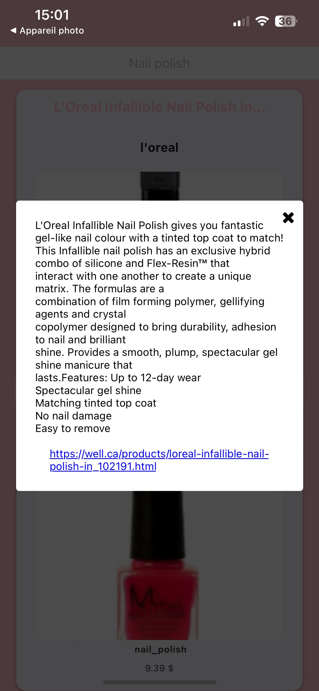
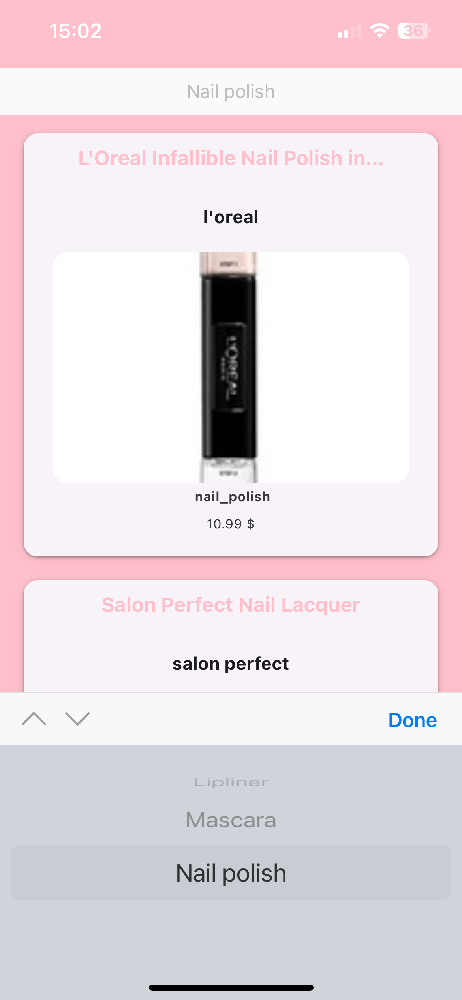

# Make your Makeup !

Ce projet a pour but d'obtenir des suggestions de différents types de maquillages, de n'importe quelle marque.
Celui-ci comporte donc un filtre pour sélectionner le maquillage selon son type (mascara, blush..). 
J'ai fait apparaitre le nom du produit, la marque, l'image (parfois indisponible, il y a donc une image par défaut), le type de maquillage et le prix (également parfois indisponible, donc éventualité anticipée).

Lorsqu'on clique sur l'item, une pop-up s'ouvre avec une description + l'url vers le produit sélectionné.

## API utilisée
- https://makeup-api.herokuapp.com/api/v1/products.json

## Preview IOS

## Screens

---

---

## Screenrecord

